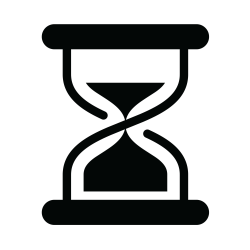

# Time-App



Time-App is a robust, networked time-tracking application built to streamline the process of clocking in and out for employees, as well as providing a myriad of tracking and reporting features for management.

## Features

- **Clock In/Out**: Employees can easily clock in or out with a simple command.
- **Real-time Tracking**: Track employee hours in real-time.
- **Reporting**: Generate reports based on employee hours, tasks, and more.
- **Job Tracking**: Assign and track specific jobs or tasks to employees.
- **Security**: Secure data handling and storage.

## Installation

1. Clone this repository: 
    ```
    git clone https://github.com/jeranon/time-et-al
    ```
2. Navigate to the directory and install the required dependencies.
3. Run the server script: 
    ```
    python server.py
    ```
4. Run the client script on each client machine: 
    ```
    python client.py
    ```

## Configuration

All configuration settings are stored in `config/config.json`. This includes settings related to server IP, data paths, and more. Make sure to configure these settings as per your environment.

## Contributions

Want to contribute? Great! Fork the project, make your changes, and then submit a pull request. All contributions are appreciated!

## License

This project is licensed under the MIT License.

